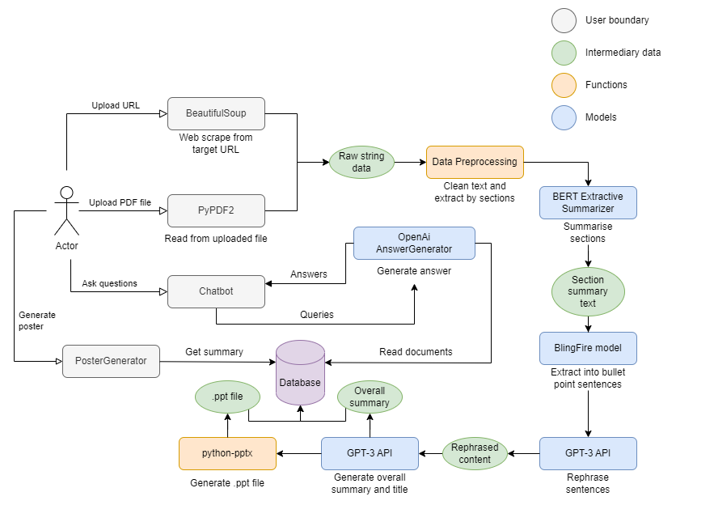

# 3Chill1Chiong 

> Submission for iNTUition v9.0

<!--  -->

## 📂 Project Folder Structure

#### Top Level Directory Layout

```terminal
.
├── data        
├── model              # NLP models
├── server             # Flask app
├── web-app            # React app
├── igitignore
├── LICENSE
└── README.md
```

## ❓ How It Works



## 🧪 Tech Stack
<p>
  
  
  
  
</p>

## 🧠 Contributors - Team 3Chill1Chiong 🏆🤟🏼

- [@RowenTey](https://github.com/RowenTey)
- [@shaowei0925](https://github.com/shaowei0925)
- [@limivann](https://github.com/limivann)
- [@Horstann](https://github.com/Horstann)


## 📖 References

- Summarizer: https://pypi.org/project/bert-extractive-summarizer/
- BlingFire: https://github.com/microsoft/BlingFire


